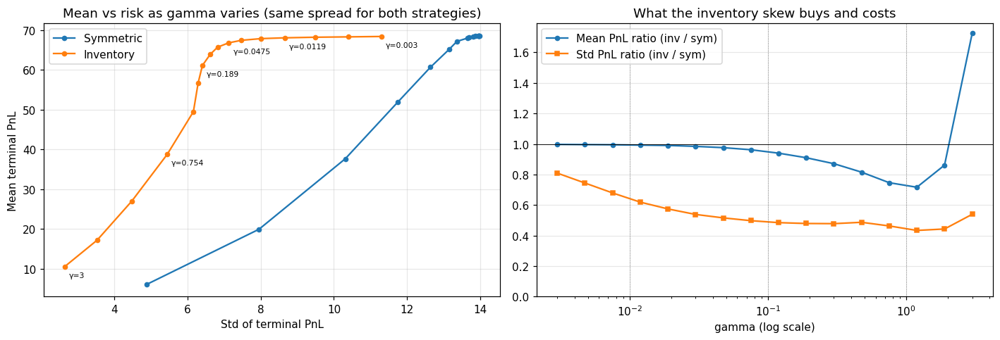
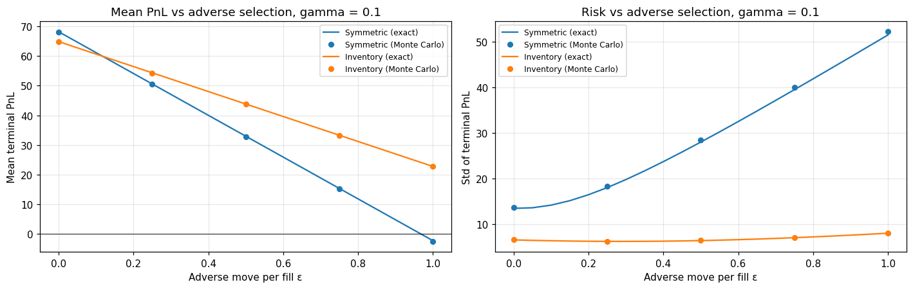
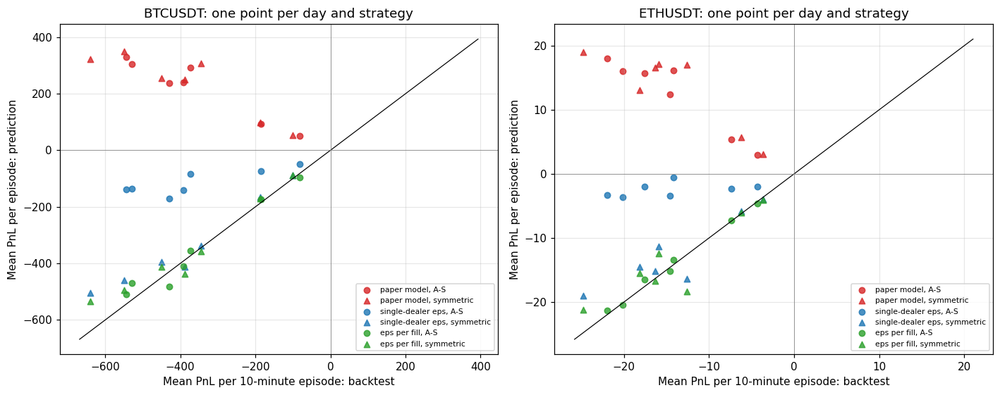
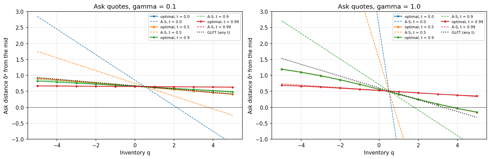

# Avellaneda–Stoikov Market Making: Replication, Extensions and a Real-Data Test

[](https://github.com/CloudWingsBD/AS_Model/actions/workflows/tests.yml)
[](LICENSE)

**Sheng Dai** · [bob.dai@mail.utoronto.ca](mailto:bob.dai@mail.utoronto.ca)

A study of the Avellaneda & Stoikov (2008) market-making model from *High-frequency trading in a limit order book* (Quantitative Finance 8(3)). The project replicates the paper exactly, extends the model with adverse selection, tests it against a week of real BTC and ETH trades from Binance, and computes the model's exact optimal quotes. The common thread is that the paper's discrete model can be solved exactly by dynamic programming on the (inventory, time) grid, so every claim can be checked without simulation noise.

## Highlights

- **Exact replication.** An exact dynamic-programming solution of the paper's model puts all 24 numbers in its Tables 1–3 within 1.9 standard errors of the true values (χ² = 19.4 with 24 degrees of freedom, p = 0.73). The solution is validated against brute-force enumeration of every path, closed forms and Monte Carlo.
- **Adverse selection.** When each fill moves the mid against the market maker by ε, the cost is exactly (ε/2)(N₁ + q_T²) on every path, where N₁ is the number of steps with exactly one fill. The textbook adjustment of the quotes over-reacts to it.
- **Real data.** Calibrated on Binance tick data, the model predicts the number of fills to within 11%, but it predicts profits where a backtest loses money every day. The cause is adverse selection: after a fill the price moves about \$16 (BTC) or \$0.55 (ETH) against the market maker, two to three times the spread earned.
- **Optimal quotes.** The exact optimum beats the A-S quotes by a wide margin at the paper's parameters (certainty equivalent 50.2 vs 22.4 at γ = 1). With the measured adverse selection it cuts real-data backtest losses by a median 95%, although no quote distance makes money when re-quoting once a second.

## Tech stack

- **Language:** Python (tested on 3.9 and 3.13)
- **Numerical computing:** NumPy, for vectorised Monte Carlo simulation and exact dynamic programming on the (inventory, time) grid
- **Data processing:** pandas, for tick-level trade data (Binance aggTrades archives), per-second aggregation, calibration and backtesting
- **Visualisation and research:** Matplotlib, Jupyter notebooks
- **Testing and CI:** pytest; GitHub Actions runs the test suite on Python 3.9 and 3.13 on every push
- **Methods:** stochastic optimal control (CARA utility, backward induction), Monte Carlo with common random numbers, exact moment recursions, statistical inference (standard errors, z-scores, χ² tests), least-squares calibration, backtesting on tick data

## Notebooks

| Notebook | Question |
|---|---|
| [`01_replication.ipynb`](01_replication.ipynb) | Does an exact solution of the paper's model reproduce its Tables 1–3? |
| [`02_adverse_selection.ipynb`](02_adverse_selection.ipynb) | What does adverse selection cost the paper's strategies, and how should the quotes respond? |
| [`03_real_data.ipynb`](03_real_data.ipynb) | How well does the model predict market making on a week of real BTC and ETH trades? |
| [`04_optimal_quotes.ipynb`](04_optimal_quotes.ipynb) | What are the exact optimal quotes, and how far are the A-S quotes from them? |

## Results in more detail

### Replication (notebook 01)

- **Matches the paper.** The dynamic program gives the exact PnL moments of the discrete model, free of simulation noise. All 24 numbers in the paper's Tables 1–3 are within 1.9 standard errors of the exact values, so the differences are just the sampling noise of the paper's 1000 paths.
- **Validated three ways.** The dynamic program agrees with brute-force enumeration of every path on a small model (to 1e−9), with the closed form for the symmetric strategy (to 1e−10), and with 40000-path Monte Carlo at the paper's parameters.
- **The trade-off.** At the same spread, skewing quotes by inventory keeps 70–100% of the symmetric strategy's mean profit and cuts its PnL standard deviation to 45–65% (γ = 0.01–1).
- **Monte Carlo cannot estimate the CARA certainty equivalent** of the symmetric strategy. At γ = 0.1 the exact value is 39.8, while Monte Carlo with 10³–10⁶ paths gives 44.5–54.0: expected utility is dominated by rare paths on which inventory runs away.
- **Results depend on dt.** At the paper's dt = 0.005, the symmetric strategy's PnL standard deviation is about 12% below its continuous-time limit.



*Left: mean vs standard deviation of terminal PnL as γ varies; at each γ both strategies use the same spread. Right: inventory / symmetric ratios. Above γ ≈ 2 the same-average-spread benchmark stops being meaningful.*

Published values vs exact values:

| γ | Strategy | Profit (paper / exact) | Std of profit (paper / exact) | Std of final q (paper / exact) |
|---|---|---|---|---|
| 0.1 | inventory | 65.0 / 64.89 | 6.6 / 6.54 | 2.9 / 2.93 |
| 0.1 | symmetric | 68.4 / 68.22 | 12.7 / 13.46 | 8.4 / 8.40 |
| 0.01 | inventory | 68.6 / 68.40 | 8.7 / 8.96 | 5.1 / 5.21 |
| 0.01 | symmetric | 68.8 / 68.67 | 12.8 / 13.68 | 8.7 / 8.71 |
| 1 | inventory | 31.4 / 31.45 | 5.0 / 4.84 | 1.7 / 1.64 |
| 1 | symmetric | 44.0 / 43.69 | 11.0 / 10.73 | 5.1 / 5.17 |

### Adverse selection (notebook 02)

Each fill moves the mid permanently by ε in the direction of the trade (`Params(impact=ε)`), and the exact dynamic program is extended to match.

- **An exact accounting identity.** On every path the PnL caused by these moves is −(ε/2)(N₁ + q_T²): each fill costs ε/2, and only terminal inventory is penalised.
- **Inventory control halves the cost.** As dt → 0 the symmetric strategy pays ε per fill and A-S about 0.55ε. At γ = 0.1, A-S overtakes the symmetric strategy on mean profit once ε > 0.12.
- **The textbook adjustment over-reacts.** Widening by ε and skewing by an extra qε (frozen-inventory indifference prices) is worse than not adjusting at all (certainty equivalent 48.6 vs 52.4 at ε = 0.25).



### Real data (notebook 03)

The model is calibrated on a week of Binance spot trades (BTCUSDT and ETHUSDT, 23–29 September 2026). Its predictions are compared with a backtest of the same strategies against the real order flow, re-quoting once a second in 10-minute episodes.

- **The fill model works.** The exponential fill curve fits the data, and the number of fills is predicted to within 11% on every day.
- **The paper's profit prediction fails.** It predicts a profit every day, while the backtest loses money every day, because of the adverse selection described above.
- **Every fill costs one full ε, for both strategies.** Inventory control does not cut the adverse-selection cost, contrary to notebook 02's single-dealer model. Charging ε per fill (`Params(fill_cost=ε)`) predicts mean PnL to within about one standard error.
- **Risk is understated, and forecasts need frequent recalibration.** The model predicts 37–72% of the actual PnL standard deviation. Calibrating on the previous hour gives a 0.5–0.6 correlation with the next hour's PnL, against about zero when calibrating on the previous day.



### Optimal quotes (notebook 04)

Backward induction on the (q, t) grid, with a closed-form first-order condition at each state, gives the exact CARA-optimal quotes of the discrete model (`mmsim.optimal_policy`).

- **A-S is far from optimal at the paper's parameters.** Its certainty equivalent is 62.8 against 65.2 for the optimum at γ = 0.1, and 22.4 against 50.2 at γ = 1. The optimal quotes are stationary away from the horizon and skew much less with inventory. The Guéant–Lehalle–Fernandez-Tapia (2013) closed form comes within 0.3 of the optimum.
- **Best response to adverse selection.** Against a per-fill cost c, the optimum moves its quotes out by about c. Against notebook 02's single-dealer impact, it skews hard only near the horizon.
- **On real data no quote distance reliably makes money** when re-quoting once a second. The optimal policy with the measured per-fill cost cuts the backtest losses by a median 95%, but still loses on every day.



## Project layout

```
mmsim/            simulator package
  params.py       Params dataclass (defaults are the paper's parameters; impact and fill_cost add adverse selection)
  strategies.py   AvellanedaStoikov, Symmetric, AdjustedAS, GLFT, TablePolicy; a new strategy implements quote(s, q, i, p) -> (centre, bid, ask)
  simulator.py    vectorised Monte Carlo: common random numbers, PnL decomposition, per-fill trade log, discretisation diagnostics
  analytics.py    exact solutions: closed-form moments of the symmetric strategy; exact moments, kurtosis, CARA CE and inventory distribution of any (q, t) strategy by dynamic programming, with or without adverse selection
  control.py      exact CARA-optimal quotes by backward induction (optimal_policy)
  stats.py        standard errors, paired differences, CARA certainty equivalent
  empirical.py    real data: load Binance aggTrades, per-second view, fill-curve calibration, backtest, adverse moves
tests/            unit tests (run by CI on every push)
scripts/          download_binance.py: fetches the trade archives used by notebooks 03 and 04 into data/ (not tracked)
figures/          figures exported from the notebooks
01_replication.ipynb         replication experiments, figures and discussion
02_adverse_selection.ipynb   adverse selection: what it costs the paper's strategies, and how to respond
03_real_data.ipynb           the model against a week of real BTC and ETH trades
04_optimal_quotes.ipynb      exact optimal quotes: how far A-S is from them, the best response to adverse selection, and a real-data test
```

## Getting started

```
pip install -r requirements.txt
pytest -q
python scripts/download_binance.py BTCUSDT ETHUSDT --start 2026-09-23 --end 2026-09-29   # data for notebooks 03 and 04, about 150 MB
jupyter notebook
```

## Usage

```python
from mmsim import Params, AvellanedaStoikov, Symmetric, simulate, draw_randomness, exact_moments, optimal_policy

p = Params()
rnd = draw_randomness(p, n_paths=1000, seed=0)          # both strategies share the same random numbers
inv = simulate(AvellanedaStoikov(gamma=0.1), p, 1000, randomness=rnd)
sym = simulate(Symmetric.matching(0.1, p), p, 1000, randomness=rnd)
print(inv.pnl.mean(), inv.pnl.std(), sym.pnl.mean(), sym.pnl.std())

policy, ce = optimal_policy(p, gamma=0.1)                # exact optimal quotes and their certainty equivalent
print(ce, exact_moments(AvellanedaStoikov(0.1), p, gamma_ce=0.1)["ce"])
```

## References

- Avellaneda, M. & Stoikov, S. (2008). High-frequency trading in a limit order book. *Quantitative Finance* 8(3), 217–224. Journal-version PDF: https://math.nyu.edu/inmemoriam/avellaneda//HighFrequencyTrading.pdf (this project compares against Tables 1–3 of this version)
- 2006 preprint: https://people.orie.cornell.edu/sfs33/LimitOrderBook.pdf (its tables differ from the published version; see Appendix B of notebook 01)
- Guéant, O., Lehalle, C.-A. & Fernandez-Tapia, J. (2013). Dealing with the inventory risk: a solution to the market making problem. *Mathematics and Financial Economics* 7(4), 477–507.
- Glosten, L. R. & Milgrom, P. R. (1985). Bid, ask and transaction prices in a specialist market with heterogeneously informed traders. *Journal of Financial Economics* 14(1), 71–100.

## License

Released under the [MIT License](LICENSE). © 2026 Sheng Dai.
